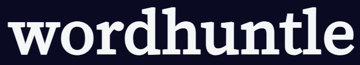

# WordHuntle Clone - React Learning Project



A personal project aimed at learning React and practicing web page creation by cloning the [WordHuntle](https://www.wordhuntle.com) website.

## Introduction

This project is a personal endeavor to enhance React skills and gain hands-on experience in web page development. By creating a clone of the popular [WordHuntle](https://www.wordhuntle.com) website, I aim to dive into the world of React components, state management, and responsive design.

## Features

- Interactive word search game.
- Timed challenges to find as many words as possible.
- Basic score tracking.
- Simplified user interface inspired by the original WordHuntle design.

## About the dictionary used

This project uses a dictionary created in https://github.com/JorgeDuenasLerin/diccionario-espanol-txt, which extracts from the RAE (Real Academia Española) all the words archived.

## Getting Started

Follow these instructions to set up the project on your local machine and start your React learning journey.

### Prerequisites

- [Node.js](https://nodejs.org) and [npm](https://www.npmjs.com/) installed on your machine.

### Installation

1. Clone the repository:

   ```bash
   git clone https://github.com/your-username/wordhuntle-clone.git
   ```

2. Navigate to the project directory:

   ```bash
   cd wordhuntle-clone
   ```

3. Install the dependencies:

   ```bash
   npm install
   ```

## Usage

To launch the development server and view the WordHuntle clone in your browser, use the following command:

```bash
npm start
```

Access the app by opening your browser and navigating to `http://localhost:3000`.

## Learning Goals

- Gain familiarity with React components and JSX syntax.
- Explore basic state management for interactive features.
- Practice responsive design principles using CSS.

## Future Enhancements

- Incorporate more advanced state management techniques.
- Implement additional features inspired by the original WordHuntle website.
- Experiment with different design approaches.

## License

This project is for personal learning purposes and is not intended for commercial use. No license is provided for this project.
